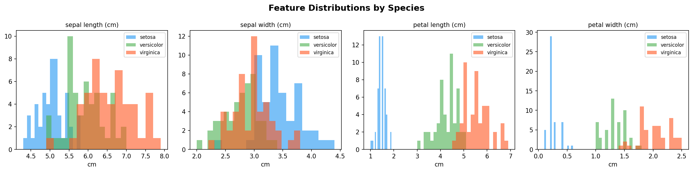
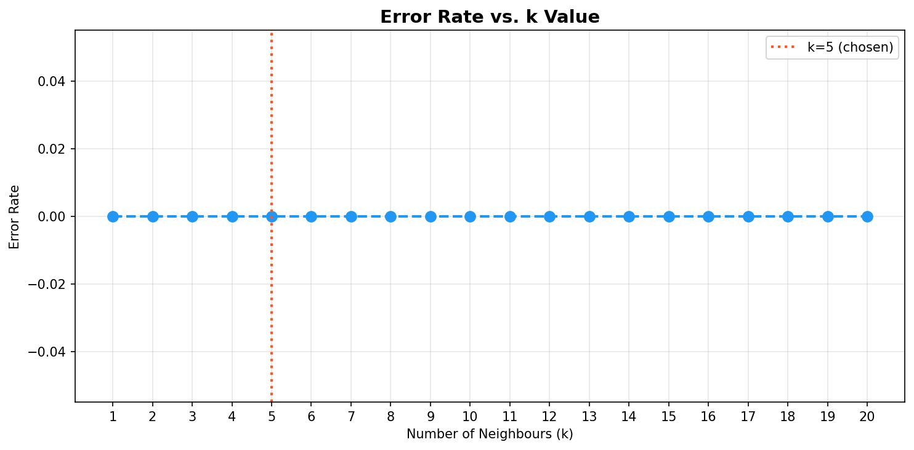
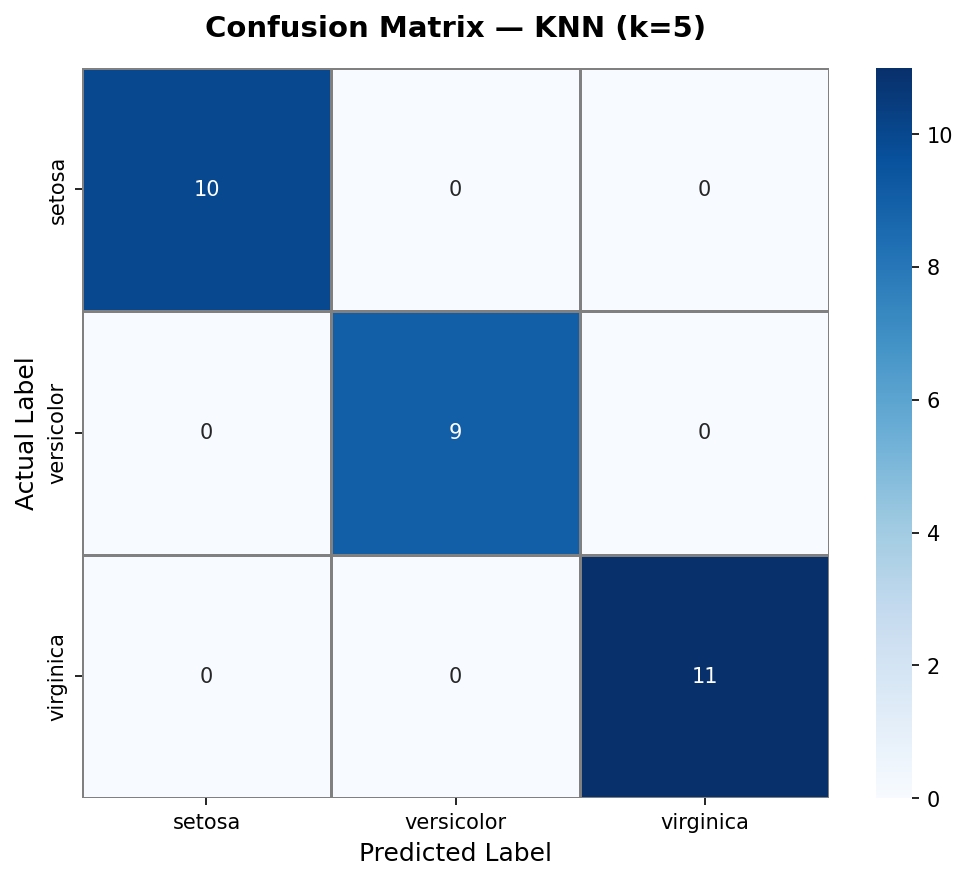
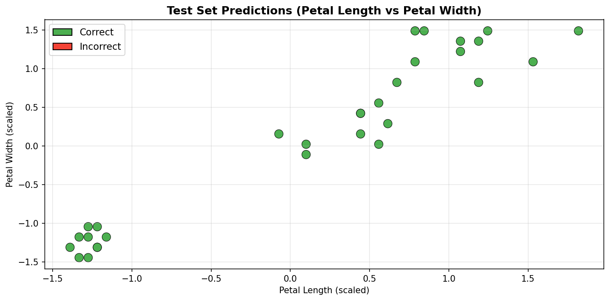
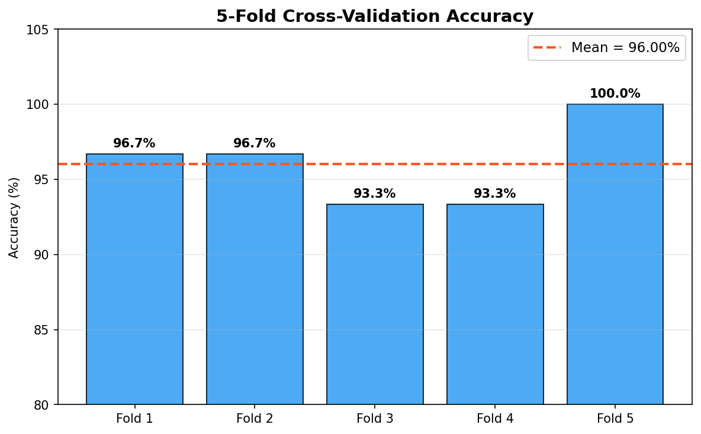

# data-classification-knn

Data Classification Using AI — KNN classifier on the Iris dataset with feature scaling, train-test split, confusion matrix, and F1 score evaluation.

**DecodeLabs AI Industrial Training | Batch 2026 | Project 2**

---

## Results

| Metric | Value |
|--------|-------|
| Algorithm | K-Nearest Neighbors (k=5) |
| Dataset | Iris (150 samples, 4 features, 3 classes) |
| Train / Test split | 80% / 20% |
| Single-split Accuracy | 100.00% |
| F1 Score (weighted) | 1.0000 |
| Cross-validation Mean | 96.00% ± 2.49% |

---

## Pipeline (IPO Framework)

```
INPUT   → Load Iris dataset → Explore → Feature Scaling (StandardScaler, fit on train only)
PROCESS → Train-Test Split (80/20) → K-Tuning → Train KNN (k=5)
OUTPUT  → Confusion Matrix + F1 Score + Cross-Validation
```

---

## Output Screenshots

### Feature Distributions by Species


### Error Rate vs. k Value (K-Tuning)


### Confusion Matrix


### Test Set Predictions


### 5-Fold Cross-Validation Accuracy


---

## Run

**Requirements:** Python 3.8+

```bash
pip install scikit-learn pandas numpy matplotlib seaborn jupyter
```

**Open the notebook:**

```bash
jupyter notebook knn_iris_classifier.ipynb
```

Then run all cells: `Kernel > Restart & Run All`

---

## Project Structure

```
data-classification-knn/
├── knn_iris_classifier.ipynb        # Main notebook — full pipeline
├── screenshots/                     # Output plots
│   ├── 1_feature_distributions.png
│   ├── 2_error_rate_vs_k.png
│   ├── 3_confusion_matrix.png
│   ├── 4_predictions_scatter.png
│   └── 5_cross_validation.png
├── docs/
│   └── Artificial intelligence P2.pdf   # Project specification
└── README.md
```
